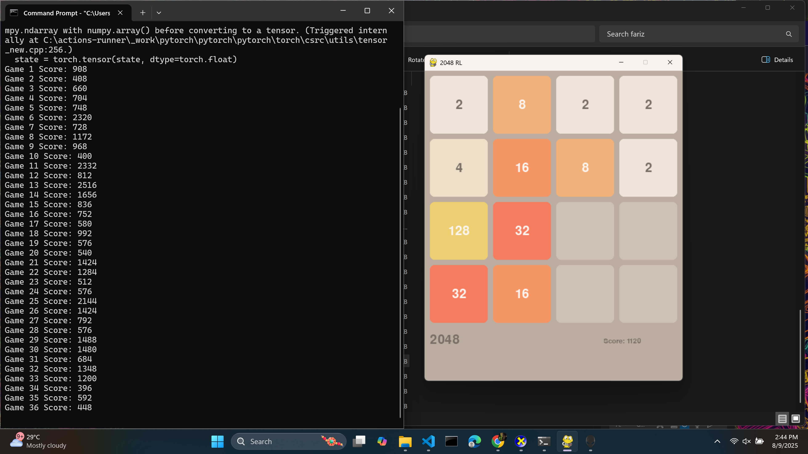

# [Project Name] 🎯


## Basic Details
### Team Name: [Name]


### Team Members
- Team Lead: Fadil Rahman - CUSAT DCS

### Project Description
My project is the famous 2048 tile game but the twist is that we don't get to play it. A model through reinforcement learning without knowing the rules, learns to play the game and get progressively better. 

### The Problem (that doesn't exist)
Problem is the 2048 game is very hard (for me) and i don't wanna play it

### The Solution (that nobody asked for)
Since i dont wanna play the game i let an agent play the game on its own figure out the rules and get better score each time it plays

## Technical Details
### Technologies/Components Used
For Software:
- [Python]
- [PyTorch]
- [PyGame,random,collection,NumPy]

# Installation
Install the required packages by running:

```bash
pip install -r requirements.txt
```

# Run

Run agent
```bash
python agent.py
```

### Project Documentation
For Software:

# Screenshots

*Gameplay by agent*


*Agent tries to get better game by game*


*Gameplay*

### Project Demo
# Video
<video src="https://raw.githubusercontent.com/fadil4u/project1/video/recording.mp4" controls width="600"></video>

*Explain what the video demonstrates*

## Team Contributions
- Fadil: Solo so i did everything


---
Made with ❤️ at TinkerHub Useless Projects 


